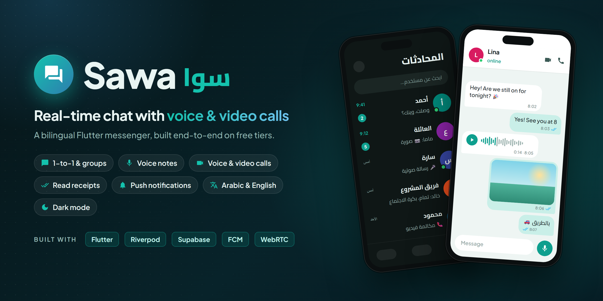
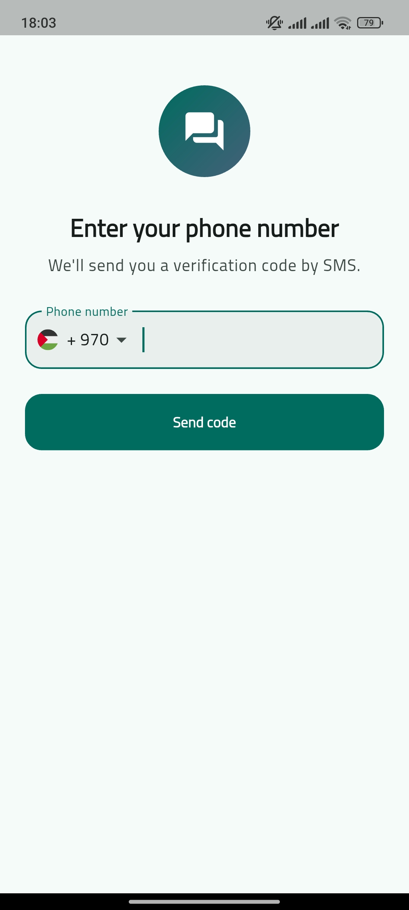
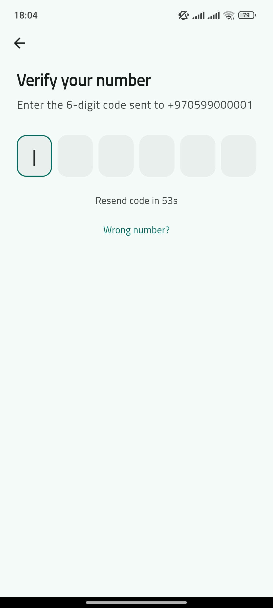
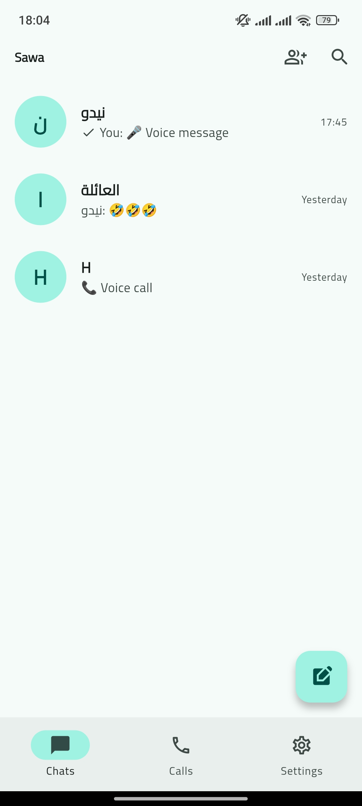
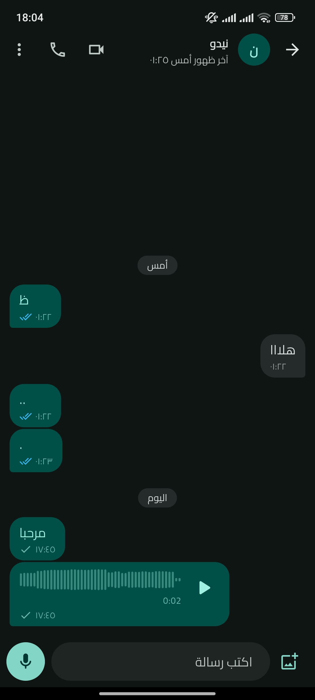
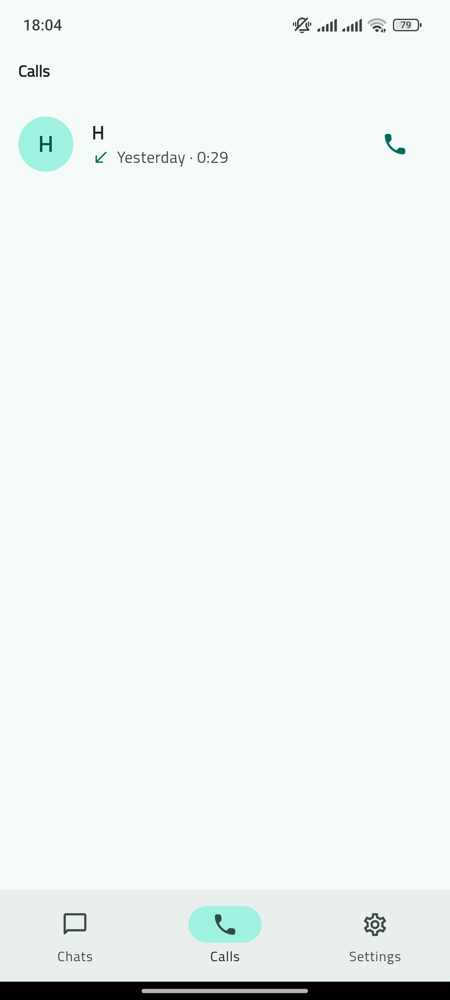
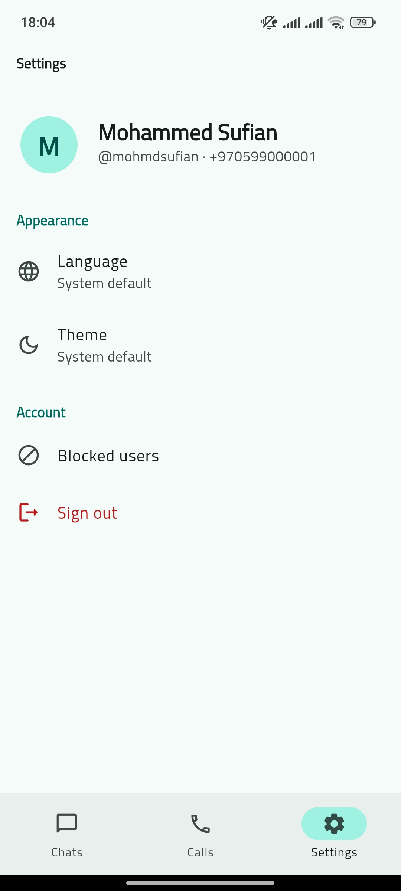
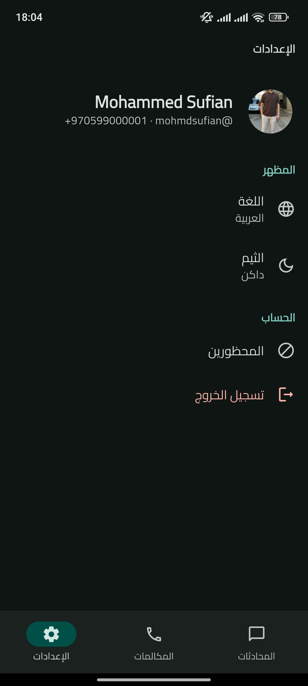
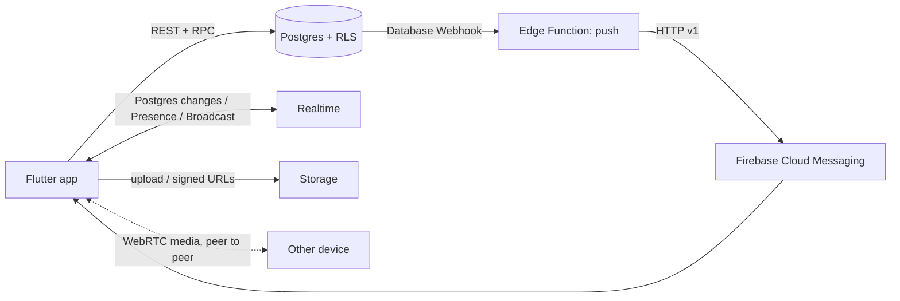

# Sawa (سوا) — Real-time Chat App

A WhatsApp-style messenger built with **Flutter** and **Supabase**: chat, groups, photos, voice notes, push notifications and peer-to-peer voice/video calls. Fully bilingual (Arabic RTL / English) with light and dark themes, and built entirely on free tiers.


## Screenshots

<table>
  <tr>
    <td align="center"><br><sub>Phone sign-in</sub></td>
    <td align="center"><br><sub>OTP verification</sub></td>
    <td align="center"><br><sub>Chat list</sub></td>
    <td align="center"><br><sub>Conversation (Arabic, dark)</sub></td>
  </tr>
  <tr>
    <td align="center"><br><sub>User search</sub></td>
    <td align="center"><br><sub>Call log</sub></td>
    <td align="center"><br><sub>Settings (English, light)</sub></td>
    <td align="center"><br><sub>Settings (Arabic, dark)</sub></td>
  </tr>
</table>

## Features

**Messaging**
- Phone-number sign-in with SMS OTP (every country code, localized country picker) and a two-step onboarding
- 1-to-1 chats and groups, updated in real time
- Optimistic sending: messages appear instantly, retry on failure, and never duplicate
- Sent ✓ / delivered ✓✓ / read ✓✓ receipts, unread counters, typing indicator, online status and last seen
- Photos: multi-select, compressed on device (EXIF stripped), streamed upload with real progress, pinch-to-zoom viewer
- Voice notes: hold to record, slide to cancel, recorded waveform, seekable playback at 1x / 1.5x / 2x
- Groups: owner / admin roles, add and remove members, rename, photo, leave
- Blocking, enforced by the database
- Offline-first: the chat list and recent messages open instantly and stay readable without internet

**Calls**
- 1-to-1 voice and video calls over WebRTC (peer-to-peer)
- Native incoming-call screen even when the app is closed (FCM data push + CallKit)
- Mute, speaker, camera on/off, flip camera, call log, and call entries in the chat

**Notifications**
- Push for new messages, written in each device's language, grouped per chat; tapping opens the conversation

**Everything else**
- Arabic and English, switchable in-app, with correct RTL layout and per-message text direction
- Light, dark and system themes

## Tech stack

| Layer | Choice |
|---|---|
| UI | Flutter, Material 3 (`material_ui`) |
| State | Riverpod 3 |
| Navigation | go_router with session-driven redirects |
| Auth | Supabase Auth (phone OTP) |
| Database | Postgres with Row Level Security |
| Realtime | Supabase Realtime: Postgres changes, Presence, Broadcast |
| Files | Supabase Storage (public avatars, private chat media + signed URLs) |
| Server code | Supabase Edge Function (Deno / TypeScript) |
| Push | Firebase Cloud Messaging HTTP v1 |
| Calls | WebRTC (`flutter_webrtc`) + `flutter_callkit_incoming` |

## Architecture



The code is feature-first, and each feature has data, application (Riverpod controllers) and presentation layers:

```
lib/
  core/            config, cache, theme, localization, router, shared widgets
  features/
    auth/          phone + OTP, session controller
    profile/       onboarding, profiles
    chats/         chat list, conversation, media, voice, receipts, typing
    groups/        create, manage members, group info
    calls/         WebRTC session, incoming-call handling, call log
    presence/      online / last seen
    notifications/ FCM registration and handling
    blocking/      block / unblock
  l10n/            ARB translations (en, ar)
supabase/
  migrations/      schema, RLS, RPCs, storage (run in order)
  functions/push/  Edge Function for notifications and call rings
```

### Design decisions worth a look

- **Read receipts with watermarks.** Each member stores `last_delivered_at` and `last_read_at` rather than one row per message per reader. Receipts cost a constant number of writes, in direct chats and groups alike.
- **The server owns the rules.** Privileged actions go through `security definer` RPCs that check the caller's role, so RLS stays strict. These include creating chats, managing members, marking messages read, changing call state, and deleting for everyone.
- **Language-neutral system messages.** Group events are stored as `{event, targets}` and rendered in the reader's language. The Arabic grammar is correct ("أضفتَ…", "…أضافك"), and clients can't forge these events.
- **Idempotent sends.** A device-generated `client_id` ties the optimistic bubble, the insert response and the realtime echo into one message, so retrying never duplicates.
- **Call state machine in SQL.** `update_call_status` only allows valid transitions (`ringing → accepted → ended`, `ringing → declined / cancelled / missed`), and writes the call summary into the chat exactly once. Busy detection ignores stale rows, so a crashed app can't leave someone permanently busy.
- **Signaling without a server.** WebRTC offers, answers and ICE candidates travel over Realtime Broadcast, and the callee re-announces itself until it receives an offer.
- **Offline-first cache.** Raw API rows are cached on disk and parsed by the same models, so the cache needs no schema of its own.

## Getting started

### 1. Supabase
1. Create a free project at [supabase.com](https://supabase.com).
2. In **SQL Editor**, run every file in `supabase/migrations/` in order (`0001` → `0004`).
3. **Authentication → Sign In / Providers → Phone**: enable it, and add test numbers such as `970599000001=123456`. For real SMS, connect a provider like a Twilio trial.
4. Copy the **Project URL** and **publishable key** from **Project Settings → API Keys**.

### 2. Configure and run
```bash
cp env.example.json env.json   # then fill it in (git-ignored)
flutter pub get
flutter run --dart-define-from-file=env.json
```
In Android Studio the shared `main.dart` run configuration already passes `--dart-define-from-file=env.json`.

### 3. Optional
- **Push notifications and call ringing:** see [docs/PUSH_SETUP.md](docs/PUSH_SETUP.md). Without it, everything else works.
- **TURN relay for calls:** set `TURN_URLS`, `TURN_USERNAME` and `TURN_CREDENTIAL` in `env.json`. Some mobile networks block direct peer-to-peer connections, and a TURN relay gets calls through.
- **Keep the free project awake:** add `SUPABASE_URL` and `SUPABASE_PUBLISHABLE_KEY` as GitHub Actions secrets. `keep-supabase-awake.yml` then pings it every 3 days.

### Tests
```bash
flutter test
```
CI runs the format check, the analyzer and the tests on every push.

## Notes
- iOS: the code and permissions are in place. Building needs a Mac, and push or call ringing on iOS needs a paid Apple Developer account (APNs / PushKit).
